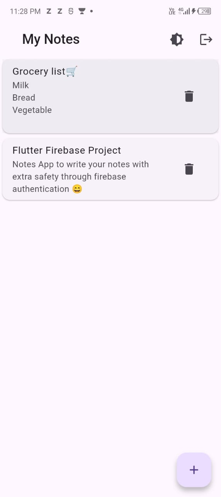
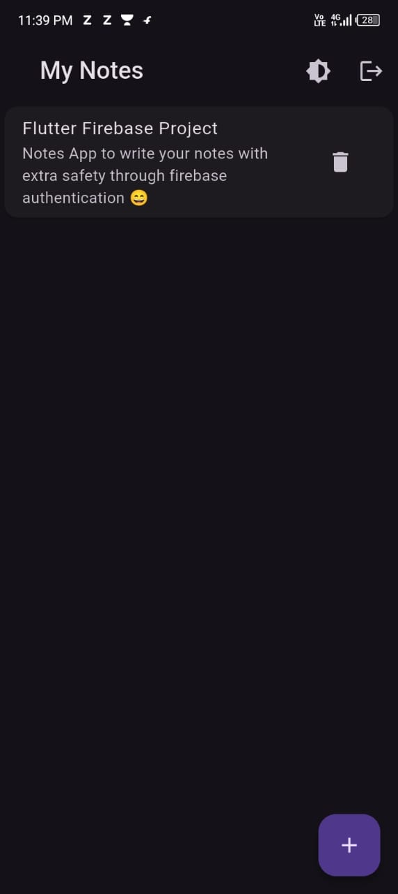
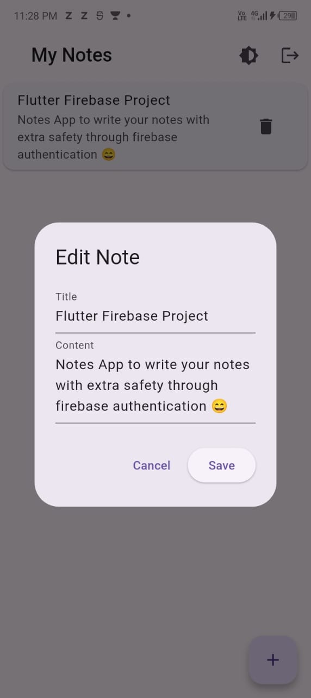
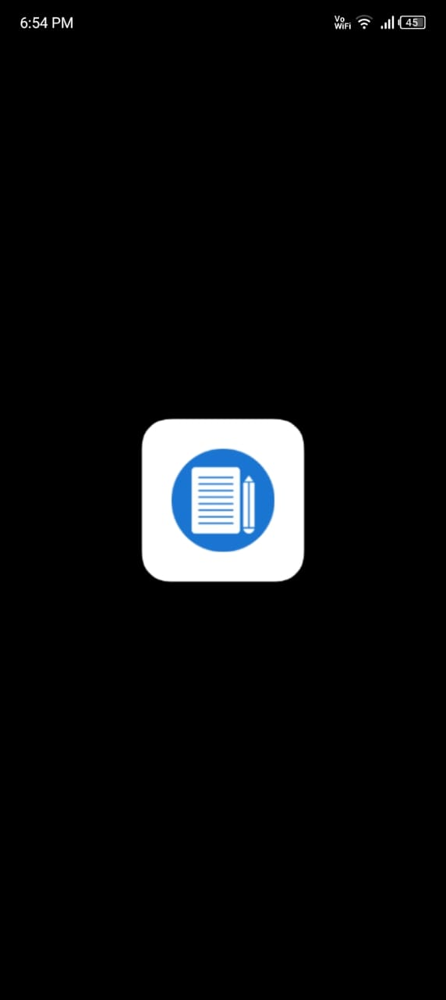
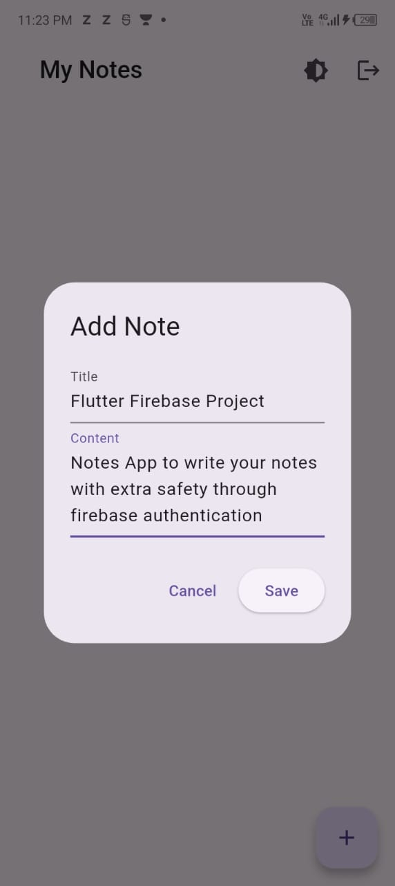

# 📝 Flutter Notes App  

A clean and simple **Notes App** built with **Flutter** and **Firebase**.  
I built this project to practice **real-world app development** and to showcase my skills in Flutter, Firebase, and UI design.  

🌐 **Live Demo** → (https://notesapp-94a70.web.app)  

---

## ✨ Features  
- 🔐 Authentication with Firebase (Login & Register)  
- 📝 Add, edit, and delete notes  
- ☁️ Cloud sync with Firestore  
- 🎨 Light & Dark Theme support  
- 📶 Works offline with Firebase cache  

---

## 🚀 Getting Started  
To run locally:  
```bash
git clone https://github.com/TheHarshitDubey/flutter-notes-app.git
cd flutter-notes-app
flutter pub get
flutter run
```

---

## 📸 Screenshots

## 📸 Screenshots 







---

## 🛠️ Tech Stack

Flutter (Dart)
Firebase Authentication
Cloud Firestore
Provider (for theme management)

---

## 📌 Future Improvements

Categories & search for notes
Pinning important notes
Reminders & notifications
Export notes as PDF

---

## 👨‍💻 About Me

Hey, I’m Harshit Dubey 👋

🎓 B.Tech CSE student passionate about App Development
💡 Practicing DSA (preparing for CodeVita 2025 & placements)
🤖 Learning Generative AI alongside Flutter to stay future-ready
🚀 I believe in learning by building projects and experimenting with new tech

---

## 📌 Connect with me:

LinkedIn: https://www.linkedin.com/in/harshit-dubey13
GitHub: https://github.com/TheHarshitDubey

---

## ⭐ Support

If you like this project, please star the repo 🌟.
Feedback, ideas, and contributions are always welcome!
